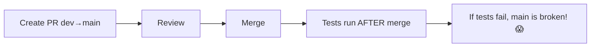
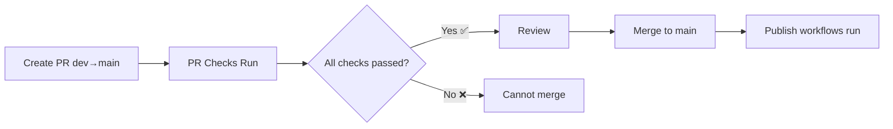

# GitHub Branch Protection Setup Guide

## Overview

This guide shows how to configure GitHub branch protection rules to prevent merging PRs when tests, deployments, or other checks fail.

## What We've Set Up

### 1. PR Checks Workflow (`pr-checks.yml`)

A new GitHub Actions workflow that runs on every pull request to `main` or `dev`:

- **TypeScript SDK Tests**: Linting, type checking, unit tests, and build
- **Python SDK Tests**: Tests across multiple Python versions (3.10-3.13)
- **Security Scan**: Trivy vulnerability scanner
- **Code Quality**: ESLint with annotations
- **All Checks Summary**: Final gate that requires all checks to pass

## Configure Branch Protection Rules

### Step 1: Navigate to Branch Protection Settings

1. Go to your GitHub repository
2. Click **Settings** → **Branches**
3. Under "Branch protection rules", click **Add rule** or edit existing rule

### Step 2: Configure Protection for `main` Branch

**Branch name pattern**: `main`

#### ✅ Required Status Checks

Check these boxes:

- ☑️ **Require status checks to pass before merging**
  - ☑️ **Require branches to be up to date before merging**
  
  Select these required checks:
  - `test-typescript` - TypeScript SDK tests
  - `test-python` - Python SDK tests
  - `security-check` - Security vulnerability scan
  - `code-quality` - Code quality checks
  - `all-checks-passed` - Final gate (MOST IMPORTANT)

#### ✅ Additional Protections

- ☑️ **Require a pull request before merging**
  - Number of required approvals: `1` (or more)
  - ☑️ **Dismiss stale pull request approvals when new commits are pushed**
  - ☑️ **Require review from Code Owners** (optional)

- ☑️ **Require conversation resolution before merging**
  - Ensures all comments are addressed

- ☑️ **Require linear history** (optional)
  - Forces rebase or squash merge (prevents merge commits)

- ☑️ **Include administrators**
  - Even admins must follow these rules

#### ❌ DO NOT Enable (For Your Workflow)

- ❌ **Require deployments to succeed before merging**
  - Your deployments happen AFTER merge, not before

### Step 3: Configure Protection for `dev` Branch (Optional)

If you want similar protection for `dev` branch:

**Branch name pattern**: `dev`

- ☑️ **Require status checks to pass before merging**
  - Same checks as `main`
- ☑️ **Require pull request reviews** (optional, can be less strict)

### Step 4: Save Rules

Click **Create** or **Save changes**

## How It Works

### Before Protection Rules



### After Protection Rules



## Testing the Setup

### 1. Create a Test PR

```bash
# Create a branch with intentional error
git checkout -b test-branch-protection
echo "const x: string = 123;" >> src/test.ts
git add src/test.ts
git commit -m "test: intentional type error"
git push origin test-branch-protection
```

### 2. Open PR

Create a PR from `test-branch-protection` → `dev` or `main`

### 3. Observe Behavior

- PR checks will run automatically
- Type check will fail due to intentional error
- GitHub will show "Some checks were not successful"
- **Merge button will be blocked** (greyed out or disabled)

### 4. Fix and Verify

```bash
# Fix the error
git revert HEAD
git push origin test-branch-protection
```

- PR checks will re-run
- All checks should pass
- **Merge button will become enabled**

## Check Status Meanings

| Icon | Status | Description |
|------|--------|-------------|
| 🟡 | Pending | Check is running |
| ✅ | Success | Check passed |
| ❌ | Failed | Check failed - merge blocked |
| ⚪ | Skipped | Check was skipped (e.g., Python tests when no Python files changed) |

## Troubleshooting

### "Required status checks are not available"

**Problem**: GitHub can't find the check names you specified.

**Solution**:
1. The check must run at least once before GitHub can see it
2. Create and merge a test PR to register the checks
3. Then add them to branch protection rules

### "Required checks never complete"

**Problem**: PR checks workflow hangs or doesn't start.

**Solution**:
1. Check GitHub Actions tab for errors
2. Verify secrets are configured: `CONVEX_URL`, `CONVEX_DEPLOY_KEY`, `OPENAI_API_KEY`
3. Check workflow file syntax

### "Merge button still available when checks fail"

**Problem**: Branch protection rules not enforced.

**Solution**:
1. Verify rule is enabled for correct branch
2. Check "Include administrators" if you're an admin
3. Force refresh the PR page

## Advanced Configuration

### Skip Checks for Specific Files

Add this to `pr-checks.yml`:

```yaml
on:
  pull_request:
    paths-ignore:
      - '**.md'
      - 'Documentation/**'
      - 'dev-docs/**'
```

### Require Multiple Reviewers for Main

In branch protection rules:

```
Number of required approvals: 2
```

### Auto-Merge When Checks Pass

```yaml
# Add to pr-checks.yml at the end
- name: Enable auto-merge
  if: github.event.pull_request.auto_merge == null
  run: gh pr merge --auto --squash ${{ github.event.pull_request.number }}
  env:
    GITHUB_TOKEN: ${{ secrets.GITHUB_TOKEN }}
```

## Best Practices

### 1. **Always Use `all-checks-passed` as Required Check**

Instead of selecting individual checks, require only `all-checks-passed`:

- ✅ Easier to maintain
- ✅ Can add/remove checks without updating branch protection
- ✅ Single source of truth

### 2. **Use Concurrency Groups**

Already configured in workflows to prevent conflicts:

```yaml
concurrency:
  group: pr-checks-${{ github.event.pull_request.number }}
  cancel-in-progress: true
```

### 3. **Fast Feedback Loop**

Order checks from fastest to slowest:
1. Linting (seconds)
2. Type checking (seconds)
3. Unit tests (minutes)
4. Integration tests (minutes)

### 4. **Separate PR Checks from Post-Merge Actions**

- **PR Checks**: Run tests, linting, security scans
- **Post-Merge**: Deploy, publish packages, create releases

### 5. **Monitor Check Performance**

If checks take too long (>10 minutes):
- Use caching (already configured with `cache: 'npm'`)
- Run heavy tests only on specific file changes
- Consider splitting into separate workflows

## Current Workflow Files

| Workflow | Trigger | Purpose |
|----------|---------|---------|
| `pr-checks.yml` | Pull requests | ✅ Block merge if tests fail |
| `test-python.yml` | Push to main | Run comprehensive Python tests after merge |
| `publish.yml` | Push to main | Publish SDK to npm after merge |
| `publish-python.yml` | Push to main | Publish Python SDK after merge |

## Summary

✅ **Created**: `pr-checks.yml` - Comprehensive PR validation
📝 **Next Step**: Configure branch protection rules in GitHub UI
🛡️ **Result**: PRs cannot merge if any check fails

## Questions?

- **Q**: Can I merge in emergency?
  - **A**: Yes, admins can temporarily disable branch protection or use "Merge without waiting for requirements"

- **Q**: What if I need to merge a hotfix quickly?
  - **A**: Create the hotfix PR, checks will run in parallel with review, shouldn't slow you down

- **Q**: Can I test this without affecting production?
  - **A**: Yes, set up rules on `dev` branch first, test there

- **Q**: What happens if GitHub Actions is down?
  - **A**: GitHub allows merge with failed checks after waiting period (configurable)

## Related Documentation

- [GitHub Branch Protection Rules](https://docs.github.com/en/repositories/configuring-branches-and-merges-in-your-repository/defining-the-mergeability-of-pull-requests/about-protected-branches)
- [Required Status Checks](https://docs.github.com/en/pull-requests/collaborating-with-pull-requests/collaborating-on-repositories-with-code-quality-features/about-status-checks)
- [GitHub Actions Workflow Syntax](https://docs.github.com/en/actions/using-workflows/workflow-syntax-for-github-actions)

