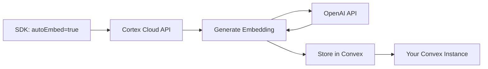

# Vector Embeddings

> **Last Updated**: 2026-01-01

Embedding strategy, dimension choices, and integration with Convex vector search.

## Overview

Cortex is **embedding-agnostic** - bring your own embeddings or use Cloud Mode for automatic generation. We support any embedding model and any dimension size that fits your needs.

**Key Principle:** Cortex provides the storage and search infrastructure; you choose the embedding strategy.

```
┌─────────────────────────────────────────────────┐
│         Direct Mode (You Manage)                │
├─────────────────────────────────────────────────┤
│ 1. Choose embedding model (OpenAI, Cohere, etc.)│
│ 2. Generate embeddings in your code             │
│ 3. Store with cortex.memory.store()             │
│ 4. Cortex indexes in Convex vector search       │
└─────────────────────────────────────────────────┘

┌─────────────────────────────────────────────────┐
│         Cloud Mode (Cortex Manages)             │
├─────────────────────────────────────────────────┤
│ 1. Set autoEmbed: true                          │
│ 2. Cortex generates embeddings automatically    │
│ 3. Cortex stores and indexes                    │
│ 4. Automatic model upgrades over time           │
└─────────────────────────────────────────────────┘
```

---

## Embedding Models

### Supported Models (All)

Cortex supports **any embedding model** that produces float64 arrays:

| Provider  | Model                   | Dimensions | Max Tokens | Quality   | Cost         |
| --------- | ----------------------- | ---------- | ---------- | --------- | ------------ |
| OpenAI    | text-embedding-3-large  | 3072       | 8191       | Excellent | $0.13/1M     |
| OpenAI    | text-embedding-3-small  | 1536       | 8191       | Good      | $0.02/1M     |
| OpenAI    | text-embedding-ada-002  | 1536       | 8191       | Good      | $0.10/1M     |
| Cohere    | embed-english-v3.0      | 1024       | 512        | Excellent | $0.10/1M     |
| Cohere    | embed-multilingual-v3.0 | 1024       | 512        | Excellent | $0.10/1M     |
| Voyage AI | voyage-2                | 1024       | 16000      | Excellent | $0.12/1M     |
| Google    | text-embedding-004      | 768        | 2048       | Good      | Free (quota) |
| Local     | sentence-transformers   | 384-1024   | Varies     | Good      | Free         |
| Local     | instructor-xl           | 768        | 512        | Good      | Free         |

**Cortex is flexible:**

- ✅ Any provider
- ✅ Any dimension (1536, 3072, 384, etc.)
- ✅ Mix models (per agent or per deployment)
- ✅ Upgrade models anytime

---

## Dimension Strategy

### Choosing Dimensions

**Trade-offs:**

| Dimensions | Storage per Vector | Search Speed | Quality   | Use Case                    |
| ---------- | ------------------ | ------------ | --------- | --------------------------- |
| 384        | ~3KB               | Fastest      | Good      | High-volume, cost-sensitive |
| 768        | ~6KB               | Fast         | Good      | Balanced                    |
| 1024       | ~8KB               | Fast         | Excellent | Cohere, Voyage              |
| 1536       | ~12KB              | Medium       | Good      | OpenAI standard (DEFAULT)   |
| 3072       | ~24KB              | Medium       | Excellent | OpenAI large, best quality  |

**Recommendations:**

- **Default (Recommended):** 1536-dim (OpenAI text-embedding-3-small) - Best balance
- **High Quality:** 3072-dim (OpenAI text-embedding-3-large) - When accuracy critical
- **Cost-Optimized:** 768-dim (local models) - Budget-constrained
- **High-Volume:** 384-dim (sentence-transformers) - Massive scale

### Setting Dimensions in Convex

```typescript
// convex/schema.ts
import { defineSchema, defineTable } from "convex/server";
import { v } from "convex/values";

export default defineSchema({
  memories: defineTable({
    memoryId: v.string(),
    memorySpaceId: v.string(),
    participantId: v.optional(v.string()),
    tenantId: v.optional(v.string()),
    embedding: v.optional(v.array(v.float64())),
    // ...
  }).vectorIndex("by_embedding", {
    vectorField: "embedding",
    dimensions: 1536, // ← Default: text-embedding-3-small
    filterFields: [
      "memorySpaceId",
      "tenantId",
      "userId",
      "agentId",
      "participantId",
    ],
  }),
});
```

**Important:** Once set, all embeddings must be this dimension. Changing requires re-embedding all documents.

### Per-Agent Dimensions (Advanced)

You can use different dimensions per agent by having separate vector indexes:

```typescript
// Not recommended, but possible
memories_1536: defineTable({ ... })
  .vectorIndex("by_embedding", { dimensions: 1536, ... }),

memories_3072: defineTable({ ... })
  .vectorIndex("by_embedding", { dimensions: 3072, ... }),

// Better: Use one dimension for consistency
```

---

## Direct Mode Integration

### Example: OpenAI Embeddings

```typescript
import OpenAI from "openai";
import { Cortex } from "@cortex-platform/sdk";

const openai = new OpenAI({ apiKey: process.env.OPENAI_API_KEY });
const cortex = new Cortex({ convexUrl: process.env.CONVEX_URL });

// Generate embedding
async function embed(text: string): Promise<number[]> {
  const response = await openai.embeddings.create({
    model: "text-embedding-3-large",
    input: text,
    dimensions: 3072,
  });

  return response.data[0].embedding;
}

// Store with embedding
await cortex.memory.store("user-123-personal", {
  content: "User prefers dark mode",
  contentType: "raw",
  embedding: await embed("User prefers dark mode"), // ← Your embedding
  source: { type: "system", timestamp: new Date() },
  metadata: { importance: 60, tags: ["preferences"] },
});

// Search with embedding
const results = await cortex.memory.search(
  "user-123-personal",
  "user preferences",
  {
    embedding: await embed("user preferences"), // ← Your embedding
    limit: 10,
  },
);
```

### Example: Cohere Embeddings

```typescript
import { CohereClient } from 'cohere-ai';
import { Cortex } from '@cortex-platform/sdk';

const cohere = new CohereClient({ token: process.env.COHERE_API_KEY });
const cortex = new Cortex({ convexUrl: process.env.CONVEX_URL });

async function embed(text: string): Promise<number[]> {
  const response = await cohere.embed({
    texts: [text],
    model: 'embed-english-v3.0',
    inputType: 'search_document',
  });

  return response.embeddings[0];
}

// Use like OpenAI
await cortex.memory.store('my-memory-space', {
  content: 'Important information',
  embedding: await embed('Important information'),
  ...
});
```

### Example: Local Models

```typescript
import { pipeline } from '@xenova/transformers';

// Load model once
const embedder = await pipeline(
  'feature-extraction',
  'Xenova/all-MiniLM-L6-v2'  // 384-dim
);

async function embed(text: string): Promise<number[]> {
  const output = await embedder(text, {
    pooling: 'mean',
    normalize: true,
  });

  return Array.from(output.data);
}

// Use with Cortex
await cortex.memory.store('my-memory-space', {
  content: text,
  embedding: await embed(text),
  ...
});
```

---

## Cloud Mode Integration

### Auto-Embeddings

```typescript
const cortex = new Cortex({
  mode: "cloud",
  apiKey: process.env.CORTEX_CLOUD_KEY,
});

// Zero-config embeddings
await cortex.memory.store("agent-1", {
  content: "User prefers dark mode",
  contentType: "raw",
  autoEmbed: true, // ← Cortex Cloud generates embedding
  source: { type: "system", timestamp: new Date() },
  metadata: { importance: 60 },
});
// No API keys, no embedding code, automatic upgrades ✅

// Search (Cloud provides query embedding too)
const results = await cortex.memory.search("agent-1", "user preferences", {
  autoEmbed: true, // ← Cortex Cloud generates query embedding
  limit: 10,
});
```

**Cloud Mode handles:**

- Embedding generation (OpenAI text-embedding-3-large)
- Model selection and upgrades
- Rate limiting and retries
- Cost optimization
- Dimension management

---

## Embedding Storage

### In Convex Documents

```typescript
{
  _id: "mem_abc123",
  memorySpaceId: "agent-1",
  content: "User prefers dark mode",
  embedding: [
    0.123456,
    -0.234567,
    0.345678,
    // ... 3072 values
  ],
  // ~24KB for 3072-dim embedding
}
```

**Storage calculation:**

- 3072 dimensions × 8 bytes (float64) = 24,576 bytes = ~24KB
- Total memory: content (< 1KB) + embedding (24KB) + metadata (< 1KB) = ~26KB

### Optional Embeddings

```typescript
// Embeddings are optional - can store without
await cortex.memory.store("agent-1", {
  content: "Debug log: Agent started",
  // No embedding - keyword search only
  source: { type: "system", timestamp: new Date() },
  metadata: { importance: 10 },
});

// Strategies:
// 1. Always embed (best search, higher cost)
// 2. Selective embed (importance >= 50)
// 3. Lazy embed (store now, embed later)
// 4. Never embed (keyword search only)
```

---

## Search Behavior

### With Embeddings (Semantic Search)

```typescript
// Query with embedding
const results = await cortex.memory.search("agent-1", "user password", {
  embedding: await embed("user password"),
  limit: 10,
});

// Convex vector search
await ctx.db
  .query("memories")
  .withIndex("by_embedding", (q) =>
    q.similar("embedding", queryEmbedding, 10).eq("agentId", "agent-1"),
  )
  .collect();

// Returns memories ranked by cosine similarity
// Even if exact keywords don't match!
```

### Without Embeddings (Keyword Search)

```typescript
// Query without embedding
const results = await cortex.memory.search("agent-1", "user password", {
  // No embedding provided
  limit: 10,
});

// Convex keyword search
await ctx.db
  .query("memories")
  .withSearchIndex("by_content", (q) =>
    q.search("content", "user password").eq("agentId", "agent-1"),
  )
  .collect();

// Returns memories with exact keyword matches
// Requires actual words to match
```

### Hybrid Search (Best of Both)

```typescript
// Cortex can combine strategies
const results = await cortex.memory.search("agent-1", "user password", {
  embedding: await embed("user password"),
  strategy: "auto", // Combines semantic + keyword
  limit: 10,
});

// Behind the scenes:
// 1. Semantic search (top 20)
// 2. Keyword search (top 20)
// 3. Merge and re-rank by combined score
// 4. Return top 10
```

---

## Embedding Best Practices

### 1. Consistent Dimensions

```typescript
// ✅ Good: Same model throughout
const EMBEDDING_MODEL = "text-embedding-3-large";
const DIMENSIONS = 3072;

const cortex = new Cortex({
  convexUrl: process.env.CONVEX_URL,
  embeddingDimensions: DIMENSIONS, // Enforced
});

async function embed(text: string) {
  return await openai.embeddings.create({
    model: EMBEDDING_MODEL,
    input: text,
    dimensions: DIMENSIONS,
  });
}

// ❌ Bad: Mixed dimensions
await cortex.memory.store("agent-1", {
  embedding: await embed1536(text), // 1536-dim
});

await cortex.memory.store("agent-1", {
  embedding: await embed3072(text), // 3072-dim ❌ Error!
});
```

### 2. Normalize Embeddings

```typescript
// Some models return normalized, some don't
function normalizeEmbedding(embedding: number[]): number[] {
  const magnitude = Math.sqrt(
    embedding.reduce((sum, val) => sum + val * val, 0)
  );

  return embedding.map(val => val / magnitude);
}

// Use with local models
const raw = await localEmbed(text);
const normalized = normalizeEmbedding(raw);

await cortex.memory.store('agent-1', {
  embedding: normalized,  // ← Normalized for better similarity
  ...
});
```

### 3. Batch Embedding Generation

```typescript
// ✅ Efficient: Batch embeddings
async function embedBatch(texts: string[]): Promise<number[][]> {
  const response = await openai.embeddings.create({
    model: 'text-embedding-3-large',
    input: texts,  // ← Multiple texts at once
  });

  return response.data.map(d => d.embedding);
}

// Store many memories efficiently
const contents = ['Memory 1', 'Memory 2', 'Memory 3'];
const embeddings = await embedBatch(contents);

for (let i = 0; i < contents.length; i++) {
  await cortex.memory.store('agent-1', {
    content: contents[i],
    embedding: embeddings[i],
    ...
  });
}
```

### 4. Cache Embeddings

```typescript
// Cache frequently-used embeddings
const embeddingCache = new Map<string, number[]>();

async function embedWithCache(text: string): Promise<number[]> {
  if (embeddingCache.has(text)) {
    return embeddingCache.get(text)!;
  }

  const embedding = await embed(text);
  embeddingCache.set(text, embedding);

  return embedding;
}

// Useful for common queries
const userPrefsEmbedding = await embedWithCache("user preferences");
```

### 5. Handle Embedding Errors

```typescript
async function safeEmbed(text: string): Promise<number[] | undefined> {
  try {
    return await embed(text);
  } catch (error) {
    console.error('Embedding failed:', error);

    // Store without embedding (keyword search still works)
    return undefined;
  }
}

// Store with fallback
await cortex.memory.store('agent-1', {
  content: text,
  embedding: await safeEmbed(text),  // undefined if fails
  ...
});
```

---

## Dimension Considerations

### Storage Impact

```typescript
// Embedding storage per dimension
const BYTES_PER_DIMENSION = 8; // float64

function calculateEmbeddingSize(dimensions: number): number {
  return dimensions * BYTES_PER_DIMENSION;
}

console.log("384-dim:", calculateEmbeddingSize(384), "bytes"); // 3KB
console.log("768-dim:", calculateEmbeddingSize(768), "bytes"); // 6KB
console.log("1536-dim:", calculateEmbeddingSize(1536), "bytes"); // 12KB
console.log("3072-dim:", calculateEmbeddingSize(3072), "bytes"); // 24KB

// For 100K memories:
// 384-dim: 100K × 3KB = 300MB
// 3072-dim: 100K × 24KB = 2.4GB
// 8× storage difference!
```

### Quality vs Cost

```typescript
// High quality (expensive)
{
  model: 'text-embedding-3-large',
  dimensions: 3072,
  cost: '$0.13/1M tokens',
  storage: '24KB per embedding',
  useCase: 'Critical information, high accuracy needed',
}

// Balanced (recommended)
{
  model: 'text-embedding-3-small',
  dimensions: 1536,
  cost: '$0.02/1M tokens',
  storage: '12KB per embedding',
  useCase: 'Most applications',
}

// Cost-optimized (free)
{
  model: 'sentence-transformers/all-MiniLM-L6-v2',
  dimensions: 384,
  cost: 'Free (local)',
  storage: '3KB per embedding',
  useCase: 'High-volume, budget-constrained',
}
```

### Migration Strategy

```typescript
// Migrating from 1536 to 3072 dimensions

// 1. Create new index (different dimension)
memories_3072: defineTable({ ... })
  .vectorIndex("by_embedding", { dimensions: 3072, ... });

// 2. Re-embed all memories
const old = await ctx.db.query("memories").collect();

for (const memory of old) {
  // Generate new embedding
  const newEmbedding = await embed3072(memory.content);

  // Store in new table
  await ctx.db.insert("memories_3072", {
    ...memory,
    embedding: newEmbedding,
  });
}

// 3. Switch SDK to new table
// 4. Delete old table when ready
```

---

## Convex Vector Index Configuration

### Basic Configuration

```typescript
.vectorIndex("by_embedding", {
  vectorField: "embedding",
  dimensions: 3072,
})
```

### With Filter Fields (Recommended)

```typescript
.vectorIndex("by_embedding", {
  vectorField: "embedding",
  dimensions: 3072,
  filterFields: ["agentId", "userId"],  // ← Pre-filter before similarity
})

// Query with pre-filtering (fast!)
await ctx.db
  .query("memories")
  .withIndex("by_embedding", (q) =>
    q.similar("embedding", queryVector, 10)
     .eq("agentId", agentId)      // ← Filtered BEFORE similarity search
     .eq("userId", userId)        // ← Much faster for large datasets
  )
  .collect();
```

**Why filterFields matter:**

- Searches only relevant subset
- Faster (fewer vectors to compare)
- Better isolation
- Lower latency

### Multiple Vector Indexes (Advanced)

```typescript
// Different indexes for different use cases
memories: defineTable({ ... })
  .vectorIndex("by_embedding", {
    vectorField: "embedding",
    dimensions: 3072,
    filterFields: ["agentId"],  // General search
  })
  .vectorIndex("by_embedding_user", {
    vectorField: "embedding",
    dimensions: 3072,
    filterFields: ["agentId", "userId"],  // User-specific search
  });

// Use appropriate index
// User-specific: use by_embedding_user (faster)
// All memories: use by_embedding
```

---

## Embedding-Optional Architecture

### Progressive Enhancement

Cortex works **with or without** embeddings:

```typescript
// Level 1: No embeddings (keyword search only)
await cortex.memory.store("agent-1", {
  content: "User email is alex@example.com",
  // No embedding
  source: { type: "system", timestamp: new Date() },
  metadata: { importance: 60 },
});

// Can still search with keywords
const results = await cortex.memory.search("agent-1", "email", {
  // No embedding provided - uses keyword search
  limit: 10,
});

// Level 2: Add embeddings later
const memory = await cortex.memory.get("agent-1", "mem-123");
await cortex.memory.update("agent-1", "mem-123", {
  embedding: await embed(memory.content), // ← Add embedding
});

// Now semantic search works too!
```

### Selective Embedding

```typescript
// Embed only important memories
async function storeWithSelectiveEmbedding(
  memorySpaceId: string,
  data: MemoryInput,
) {
  const shouldEmbed = data.metadata.importance >= 70;

  await cortex.memory.store(agentId, {
    ...data,
    embedding: shouldEmbed ? await embed(data.content) : undefined,
  });
}

// Saves embedding costs for low-importance memories
```

---

## Query Embedding Strategy

### Query Expansion

```typescript
// Generate multiple query variations
async function expandedSearch(memorySpaceId: string, query: string) {
  const variations = [
    query,
    `user ${query}`,
    `agent ${query}`,
    `${query} information`,
  ];

  const embeddings = await Promise.all(variations.map((v) => embed(v)));

  // Search with each variation
  const allResults = await Promise.all(
    embeddings.map((emb) =>
      cortex.memory.search(agentId, query, {
        embedding: emb,
        limit: 10,
      }),
    ),
  );

  // Merge and deduplicate
  const seen = new Set();
  const unique = [];

  for (const results of allResults) {
    for (const result of results) {
      if (!seen.has(result.id)) {
        seen.add(result.id);
        unique.push(result);
      }
    }
  }

  return unique;
}
```

### Query Rewriting

```typescript
// Use LLM to improve query
async function semanticQuery(memorySpaceId: string, userQuery: string) {
  // Rewrite for better search
  const improved = await llm.complete({
    prompt: `Rewrite this query for semantic search: "${userQuery}"`,
    maxTokens: 50,
  });

  // Search with improved query
  return await cortex.memory.search(agentId, improved, {
    embedding: await embed(improved),
    limit: 10,
  });
}
```

---

## Performance Considerations

### Embedding Generation

**Latency:**

- OpenAI API: 50-200ms
- Cohere API: 50-150ms
- Local models: 10-50ms

**Throughput:**

- OpenAI: 3000 RPM (batching helps)
- Cohere: 10,000 RPM
- Local: Unlimited (CPU-bound)

**Cost:**

- OpenAI 3072-dim: $0.13/1M tokens (~$0.0001 per embedding)
- OpenAI 1536-dim: $0.02/1M tokens (~$0.00002 per embedding)
- Local: Free (hardware cost)

### Vector Search Performance

**Convex vector search:**

- < 100ms for millions of vectors
- Pre-filtering with filterFields (much faster)
- Cosine similarity (optimized)

```typescript
// With filterFields (fast)
.vectorIndex("by_embedding", {
  vectorField: "embedding",
  dimensions: 3072,
  filterFields: ["agentId"],  // ← Searches only agent's vectors
})

// 1M total vectors, 1K per agent
// Without filtering: Searches 1M vectors (~200ms)
// With filtering: Searches 1K vectors (~10ms)
// 20× faster!
```

---

## Embedding Strategies by Use Case

### Chatbot (User-Agent)

```typescript
// Store user message with embedding
await cortex.memory.remember({
  memorySpaceId: "chatbot",
  conversationId: "conv-123",
  userMessage: req.body.message,
  agentResponse: response,
  userId: req.user.id,
  userName: req.user.name,
  generateEmbedding: embed, // Provide embedding function
});

// Semantic search for context
const context = await cortex.memory.search("chatbot", req.body.message, {
  embedding: await embed(req.body.message),
  userId: req.user.id,
  limit: 5,
});
```

**Recommendation:** 1536-dim (balanced quality/cost)

### Knowledge Base

```typescript
// Store KB articles
await cortex.immutable.store({
  type: "kb-article",
  id: "refund-policy",
  data: {
    title: "Refund Policy",
    content: "Detailed refund policy...",
  },
});

// Index for search (with embedding)
await cortex.vector.store("kb-agent", {
  content: "Refund Policy: Detailed refund policy...",
  embedding: await embed("refund policy content"),
  immutableRef: { type: "kb-article", id: "refund-policy" },
  metadata: { importance: 90, tags: ["policy"] },
});

// All agents can search
const results = await cortex.memory.search("any-agent", "refund policy", {
  embedding: await embed("refund policy"),
});
```

**Recommendation:** 3072-dim (best quality for reused content)

### High-Volume Logs

```typescript
// System logs without embeddings
await cortex.vector.store("agent-1", {
  content: "System started at 10:00 AM",
  // No embedding - saves cost
  source: { type: "system", timestamp: new Date() },
  metadata: { importance: 10, tags: ["debug"] },
});

// Keyword search works fine
const logs = await cortex.memory.search("agent-1", "started", {
  // No embedding - keyword search
  tags: ["debug"],
  limit: 100,
});
```

**Recommendation:** No embeddings (keyword search sufficient)

---

## Cloud Mode Embedding Pipeline

### How Auto-Embed Works



**Process:**

1. Developer calls `cortex.memory.store({ autoEmbed: true })`
2. Cortex Cloud receives request
3. Generates embedding (OpenAI text-embedding-3-large, 3072-dim)
4. Stores in your Convex instance with embedding
5. Returns memory ID to developer

**Benefits:**

- No API key management
- Automatic retries and error handling
- Model upgrades (when better models release)
- Usage-based pricing ($0.02/1K tokens)

---

## Dimension Migration

### Changing Dimensions

If you need to change embedding dimensions:

```typescript
// 1. Update schema
memories: defineTable({ ... })
  .vectorIndex("by_embedding", {
    dimensions: 3072,  // Was 1536
  });

// 2. Re-embed all memories
export const reEmbedAll = mutation({
  handler: async (ctx) => {
    const memories = await ctx.db.query("memories").collect();

    for (const memory of memories) {
      if (memory.embedding) {
        // Mark for re-embedding
        await ctx.db.patch(memory._id, {
          metadata: {
            ...memory.metadata,
            needsReEmbedding: true,
          },
        });
      }
    }
  },
});

// 3. Re-embed action
export const reEmbedMemory = action({
  args: { memoryId: v.id("memories") },
  handler: async (ctx, args) => {
    const memory = await ctx.runQuery(api.memories.get, {
      memoryId: args.memoryId,
    });

    // Generate new embedding
    const newEmbedding = await embed3072(memory.content);

    // Update
    await ctx.runMutation(api.memories.patch, {
      memoryId: args.memoryId,
      embedding: newEmbedding,
      metadata: {
        ...memory.metadata,
        needsReEmbedding: false,
      },
    });
  },
});

// 4. Run for all memories
const memories = await cortex.memory.list('agent-1');
for (const memory of memories.memories) {
  if (memory.metadata.needsReEmbedding) {
    await convexClient.action(api.memories.reEmbedMemory, {
      memoryId: memory.id,
    });
  }
}
```

---

## Advanced Dimension Strategies

### Strategy 1: Importance-Based Dimensions

Match dimension to importance level for optimal cost/accuracy balance:

```typescript
async function embedByImportance(
  text: string,
  importance: number, // 0-100
): Promise<number[]> {
  if (importance >= 80) {
    return await embedLarge(text); // 3072 dimensions for high importance
  } else if (importance >= 40) {
    return await embedStandard(text); // 1536 dimensions for medium
  } else {
    return await embedSmall(text); // 384 dimensions for low importance
  }
}

// Use when storing
await cortex.vector.store(memorySpaceId, {
  content: text,
  contentType: "raw",
  embedding: await embedByImportance(text, importance),
  source: { type: "system", timestamp: new Date() },
  metadata: { importance, dimension: getDimension(importance) },
});
```

**Pros:** Optimizes cost/accuracy tradeoff  
**Cons:** More complex, different models to manage

### Strategy 2: Progressive Enhancement

Start small, upgrade important memories based on usage:

```typescript
// Initially store with small embeddings
const memory = await cortex.vector.store(memorySpaceId, {
  content: text,
  contentType: "raw",
  embedding: await embedSmall(text), // 384
  source: { type: "system", timestamp: new Date() },
  metadata: { importance: 50, dimension: 384 },
});

// If memory gets accessed frequently, upgrade
if (memory.accessCount > 10) {
  await cortex.vector.update(memorySpaceId, memory.memoryId, {
    embedding: await embedLarge(text), // 3072
    metadata: {
      dimension: 3072,
      importance: Math.min(memory.metadata.importance + 10, 100),
      upgraded: true,
    },
  });
}
```

**Pros:** Optimize for actual usage  
**Cons:** Requires monitoring and maintenance

### Strategy 3: Hybrid Approach

Use different dimensions for different memory types:

```typescript
// Critical information: High accuracy
await cortex.vector.store(memorySpaceId, {
  content: "Security protocol XYZ requires 2FA",
  contentType: "raw",
  embedding: await embedLarge(content), // 3072 dimensions
  source: { type: "system", timestamp: new Date() },
  metadata: {
    importance: 95,
    dimension: 3072,
  },
});

// General information: Balanced
await cortex.vector.store(memorySpaceId, {
  content: "User prefers dark mode",
  contentType: "raw",
  embedding: await embedStandard(content), // 1536 dimensions
  source: { type: "system", timestamp: new Date() },
  metadata: {
    importance: 50,
    dimension: 1536,
  },
});

// High-volume logs: Fast
await cortex.vector.store(memorySpaceId, {
  content: "User visited pricing page",
  contentType: "raw",
  embedding: await embedSmall(content), // 384 dimensions
  source: { type: "system", timestamp: new Date() },
  metadata: {
    importance: 15,
    dimension: 384,
  },
});
```

### Migrating Between Dimensions

```typescript
// Upgrade dimensions for existing memories
async function upgradeDimensions(memorySpaceId: string) {
  const memories = await cortex.vector.search(memorySpaceId, "*", {
    metadata: { dimension: 384 },
    limit: 1000,
  });

  console.log(`Upgrading ${memories.length} memories to 3072 dimensions...`);

  for (const memory of memories) {
    const newEmbedding = await embedLarge(memory.content);

    await cortex.vector.update(memorySpaceId, memory.memoryId, {
      embedding: newEmbedding,
      metadata: {
        ...memory.metadata,
        dimension: 3072,
        upgradedAt: new Date(),
      },
    });
  }

  console.log("Upgrade complete!");
}
```

---

## Next Steps

- **[Search Strategy](./search-strategy)** - Multi-strategy search implementation
- **[Performance](./performance)** - Optimization techniques

---

**Questions?** Ask in [GitHub Discussions](https://github.com/SaintNick1214/cortex/discussions).
