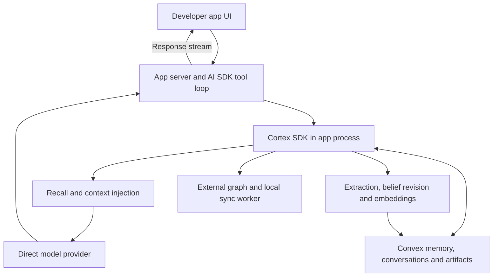
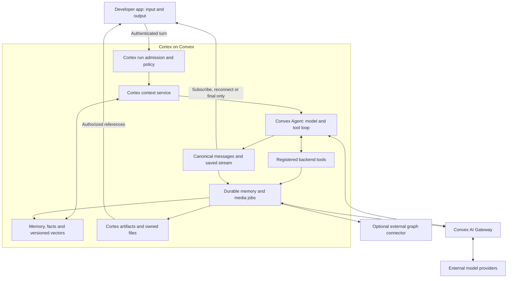

# Cortex backend runtime: architecture revision

**Date:** 2026-10-02 (America/Los_Angeles)
**Phase:** Research and planning only; no product implementation or live qualification.
**Prompt:** [Architecture research prompt](../prompts/convex-backend-runtime-2026-10-02.md)
**Earlier evidence:** [Gateway report](report.md)
**Revised plan:** [Backend-runtime goal](../../_goals/convex-backend-runtime-2026-10-02/goal.md)
**Current alignment:** [Decision register](decision-gates.md) governs this user-scoped revision. Product direction and runtime defaults are aligned, including clean-slate embeddings. The [earlier planning PASS](../../_goals/convex-backend-runtime-2026-10-02/qa/planning-review-2.md) covered a broader superseded scope; independent goal review and live compatibility qualification remain outstanding. Implementation is not authorized.

## 1. Direction and scope

Recommend composing a Cortex-owned backend runtime from Convex Agent, Workflow/Workpool and AI Gateway. The application submits an authenticated user turn and observes output; Cortex resolves context, executes the model/tool loop and durably schedules memory work. This is a substantial ownership change, rather than just a different model URL.

User-approved planning scope includes the backend runtime, reactive streaming, per-function model controls, asynchronous memory, retained artifacts fed by Gateway generation, the public runs direction and expanded authorization. Transcript unlocks retain revision tracking/stale-memory detection. Python, legacy-Cortex deployment/data migrations and external media storage are excluded. Embeddings are designed from scratch without previous model/dimension/schema constraints or upgrade tooling. Media stays within 20,000,000 bytes; future image-memory analysis has a reference/lineage seam only. AI SDK 7 is approved. Decisions are excluded. The decision register records the confirmed runtime defaults.

“Inside Cortex/Convex” describes orchestration and control. Model inference still runs through external providers behind Gateway. Existing Neo4j/Memgraph graph storage remains external. Media storage remains in Convex and delivery is capped; no external media adapter is planned. Developers configure and deploy agent instructions, tools and policies during setup; ordinary backend-only turns then need only input and output. Human approval and browser/device tools introduce deliberate extra interactions.

## 2. Verified current architecture

The quickstart invokes `streamText` in the app route; the wrapper recalls/injects context and delegates to the caller's model. The SDK orchestrates memory and holds the graph worker. Nonstream remember is an unawaited promise; streaming flush awaits memory work after text collection. These are source observations, not measured live latency/failure results.

Evidence: [chat route](../../packages/vercel-ai-provider/quickstart/app/api/chat/route.ts:281), [provider execution](../../packages/vercel-ai-provider/src/provider.ts:140), [provider persistence](../../packages/vercel-ai-provider/src/provider.ts:174), [stream flush](../../packages/vercel-ai-provider/src/provider.ts:427), [memory orchestration](../../src/memory/index.ts:1181), [Cortex constructor](../../src/index.ts:491), [graph worker](../../src/graph/worker/GraphSyncWorker.ts:136).

## 3. Proposed architecture and ownership

| Concern | Recommended owner | Boundary |
|---|---|---|
| Public conversation identity | Cortex | Tenant, memory-space, sharing, retention, metadata, Agent thread mapping |
| Executable transcript | Convex Agent | Ordered messages, tool calls/results, multimodal parts and stream deltas |
| Public run lifecycle | Cortex run ledger | Principal/grant, request deduplication, policy versions, statuses, output references and usage |
| Execution checkpoints/queues | Workflow/Workpool | Bounded tasks, persisted progress and controlled retry/pause/resume |
| Context and semantic memory | Cortex domain services | Recall, context budgets, fact eligibility, belief revision, vectors, graph and governance |
| Model transport | Official Gateway provider | Private action-local service token and supported native interfaces |
| Asset lifecycle | Cortex artifacts/attachments | Versions, references, ownership, access, provenance and retention |
| Presentation | TypeScript/React clients | Typed submission/observation, UI parts, artifacts and approvals |

Agent supports custom context handlers, so Cortex can inject its recall without adopting Agent's independent cross-thread memory retrieval. Start with Agent's ordered recent transcript plus Cortex retrieval; disable duplicate Agent semantic retrieval/embedding unless deliberately configured for a separate purpose. [Context control](https://docs.convex.dev/agents/context).

Use composition rather than a custom model/tool runtime. A proxy alone leaves orchestration, disconnected execution and memory jobs in the app. Building a custom runtime duplicates Agent's typed message/tool/stream behavior. Agent does not replace Cortex memory, governance or artifacts. [Agent overview](https://docs.convex.dev/agents/overview), [workflows](https://docs.convex.dev/agents/workflows).

## 4. Canonical transcript and run lifecycle

Use Cortex conversation identity/access metadata mapped to an authoritative Agent thread. Cortex conversation endpoints read and write that same store through adapters. Reads remain available subject to access scope. Managed history has an administrator-controlled write lock; unlocking allows authorized append/edit/delete with actor/source revisions and stale-derived-memory detection. It never turns off authentication, tenant isolation, model/budget controls or vector shape guards. A search/export projection is one-way and rebuildable.

Changed sources invalidate dependent derived memory and reset stage readiness. Old-revision ingestion results cannot commit, and an active run detects a changed transcript before final completion rather than silently attaching obsolete output. Exact Agent edit mechanics/reconciliation are a bounded qualification gate. Fresh new-architecture installations are the target; no old transcript import, identity adoption, compatibility bridge or existing-Cortex upgrade is included. Agent supports manual message save/delete and configurable automatic storage. [Agent messages](https://docs.convex.dev/agents/messages).

Current conversations store an expanding string-message array, and Cortex's existing agent registry is discovery metadata rather than executable registration. Introduce a distinct, versioned backend agent definition containing instructions, registered tools, context/memory policies, model policies, budgets and approval rules. [Conversation schema](../../convex-dev/schema.ts:79), [append](../../convex-dev/conversations.ts:420), [agent registry](../../convex-dev/agents.ts:1).

Proposed turn flow:

1. Authenticate the caller and resolve trusted scope. Deduplicate the client request key, reserve bounded budget, persist the input and enqueue execution durably. Reject a reused key with different input. Default to queued/serialized mutating runs per conversation; explicit branches can run independently.
2. Pin agent/model/prompt policy versions, transcript revision and an authorized context snapshot. Compose recent approved transcript, scoped Cortex recall and the eligible pending memory tail within the selected model's token budget. Retrieval text remains evidence, not privileged instructions.
3. Run the Agent loop with registered backend tools. Each model call and tool invocation gets an operation identity, authorization and budget check. Persist grouped output deltas and typed parts. Never publish raw hidden reasoning, injected context or tool secrets by default.
4. Commit final assistant output and register ingestion work. Prefer one supported transaction; qualify component transaction boundaries. If Agent commits separately, use a durable message-ID cursor/outbox and reconciler to detect finalized messages with missing ingestion receipts. A process-local promise is insufficient.
5. Mark response completion independently from memory and graph completion. Clients may stop observing at final output or keep observing indexing/media status.

Keep `responseStatus`, `memoryStatus`, `graphStatus` and media job state separate. A successful answer with pending or failed indexing is an observable state. A deletion tombstone, failed generation, cancelled partial attempt and approved completed output are distinct cases.

Persisted streaming supports reconnect and multiple observers; chunk/throttle writes. It restores saved output visibility, not an interrupted provider stream at its next token. Workflow retries must distinguish an unfinished action, a completed checkpoint and an ambiguous external effect. Partial attempts remain marked partial; a replacement attempt cannot silently append a duplicate final response. [Streaming](https://docs.convex.dev/agents/streaming), [durable workflows](https://docs.convex.dev/agents/workflows).

Tool approvals are capability-driven, not a mandatory click for ordinary tools. Browser/device tools require an explicit client execution lane; arbitrary local closures cannot be serialized into a Convex action. Cancellation stops future authorized work and local delivery where possible; it cannot promise reversal of a completed tool effect or provider charge. [Tools](https://docs.convex.dev/agents/tools), [approval](https://docs.convex.dev/agents/tool-approval).

## 5. Asynchronous memory and consistency guarantees

Durably record the user event at admission. Its eligible memory work can run while the answer streams. Unlocked edits carry a new source revision; obsolete derived records are excluded until repaired. Pin the generation context so background indexing cannot unpredictably change an already running prompt. Ingest assistant output only after finalization and according to source policy; do not extract durable facts from unfinished token fragments.

Next-turn context must read the approved transcript even when semantic indexing lags. Track stage-specific `indexedThrough` as contiguous eligible completion by conversation and scoped ingestion sequence for shared memory. Later finished events cannot advance across an earlier pending/failed hole. Combine indexed memory with a bounded eligible unprocessed tail, deduplicated against recent history by source event/revision, retaining source/chronology so old derived facts do not override newer explicit user statements. This protects ordinary same-thread continuity, but is not a guarantee of globally current cross-thread facts or graph projections.

Ordinary runs still use existing indexed memory. “Fully indexed” is a scoped guarantee that selected eligible sources have completed required processing stages through a captured cutoff; it is not a guarantee of perfect extraction, complete recall or all future events finishing. Agreed default: indexed memory plus pending context for ordinary chat; an explicit strict memory barrier for tasks requiring indexed completeness. If a relevant pending tail exceeds context limits, wait for the required watermark or return an explicit incomplete-context condition; silently truncating it would weaken the claimed freshness guarantee. Strict callers choose the required stages (facts/vectors and optionally graph), deadline and failure behavior. Same-conversation raw-history continuity is the default; cross-space completeness is explicit.

Convex vector search reflects a written vector immediately. The asynchronous lag described here is Cortex's source processing—extraction/conflict resolution/embedding generation and external graph projection—rather than a claim that a committed Convex vector waits for eventual search visibility. [Vector consistency](https://docs.convex.dev/search/vector-search).

The durable pipeline needs stable source event IDs, source role/trust, extraction/prompt/model versions, deduplication receipts, per-stage status and lineage to memories/facts/vectors. User assertions, verified tool results and assistant claims are different evidence. Assistant speculation must not become an authoritative user fact. Current extraction combines user and assistant text; this requires explicit source policy in the new pipeline. [Extraction prompt](../../src/llm/index.ts:133).

Extraction can parallelize; belief commits require ordering and compare-current-version checks. Resolve candidates outside the mutation, then atomically revalidate and apply the revision, fact history, provenance and projection event. A late older event must not overwrite a newer correction. Current `SUPERSEDE` creates and supersedes in separate client calls. [Belief revision](../../src/facts/belief-revision.ts:575).

Retries are bounded and idempotent locally. Failed extraction/vector/graph stages remain failed with retry/dead-letter state, not silently indexed. Deletion cancels pending work and establishes tombstones checked before every commit. Transcript edits invalidate source-derived stages and stale-revision results; memory repair is normal new-data lifecycle work rather than old-architecture migration. This prevents delayed processing from recreating deleted information.

External graph sync becomes a tenant-scoped, versioned projection outbox with leases, receipts and explicit failure. Qualify a Node-action connector; use a trusted service worker only if Convex runtime/network requirements cannot support the existing graph transport. Fence external graph writes by source revision/epoch and transactional tombstones where supported. If an expired-lease worker can deliver a stale write after deletion, reconciliation must detect/repair it and strict graph freshness stays blocked until repair. A local preflight check alone is insufficient. Current graph uses Bolt and a client-held subscription worker; exhausted queue retries currently mark `synced: true`. [Graph adapter](../../src/graph/adapters/CypherGraphAdapter.ts:47), [queue](../../convex-dev/graphSync.ts:20).

## 6. Model routing is a control-plane pillar

Gateway transports a requested model; it is not the Cortex operation-policy engine. Several upstream routing controls are rejected. Cortex resolves a deterministic policy before every billable operation. Decisions and adaptive model optimization are excluded. [Gateway API](https://docs.convex.dev/ai-gateway/api).

Required operation keys include `agent.respond`, `memory.extract`, `facts.resolve`, `memory.summarize`, `embedding.query`, `embedding.memory`, `conversation.title`, `artifact.text`, `artifact.code`, `artifact.sheet`, `media.image.generate` and `media.video.generate`. Additional internal calls must use registered operation keys; no hidden direct title/artifact/suggestion models.

| Policy field | Requirement |
|---|---|
| Model and interface | Provider-qualified model ID and Chat/Messages/Responses/embedding/image/video capability |
| Scope and override | Deployment defaults, tenant rules, versioned agent policy and operation; only trusted administrators may override allowlists/budgets |
| Request constraints | Context/output limits, structured output/tool support, permitted options, timeouts and tool-step limits |
| Cost and concurrency | Per-operation, run and tenant admission reservations; total run includes secondary model calls and media |
| Fallback | Explicit compatible candidates and safe failure boundary; never replay visible output or ambiguous effects automatically |
| Audit | Requested/resolved/actual model when supplied, interface, policy version, source event, attempt, usage/cost and uncertain outcome |

Pin a resolved policy snapshot to a run and ingestion event; retries cannot silently adopt a newer model/prompt. Emergency revocation/allowlist changes can still stop future steps. Internal memory calls bypass the user-chat recall/remember wrapper to prevent recursive ingestion.

The embedding architecture is clean-slate. Keep logical source content and versioned chunks separate from derived vector records. Each vector references its source revision/chunk, tenant/space, immutable semantic profile and processing receipt. The profile defines model identity, dimensions and preprocessing/chunking version; index layouts are selected for the supported new-runtime models rather than copied from the old memory/fact/artifact schema. The core text slice declares its default profile up front; the embedding extension qualifies additional supported profiles.

Storage and query policies resolve the same compatible profile. Pin that resolution to each job/query, filter by profile and current authorized source revision, and validate dimensions against the configured index. Same-dimensional vectors from different model profiles cannot be compared. Convex vector indexes require declared dimensions, so supported profiles/index configurations are registered during setup; arbitrary runtime model overrides cannot invent an index. [Vector requirements](https://docs.convex.dev/search/vector-search).

Separate derived generations provide a future seam for new models and image-artifact analysis without redesigning source identity. This goal does not build old-corpus conversion, legacy compatibility or a general reindex workflow. Policy edits never relabel existing vectors or silently fall back across profiles; unavailable compatible vectors/indexes produce an explicit readiness/capability outcome. Provider aliases that drift require an operational policy; metadata cannot invent an immutable revision the provider does not expose.

## 7. Media: adopt generation, keep artifacts

Gateway supplies image and video inference; Agent files supply message references; Cortex artifacts retain identity, versions, memory links, governance and storage ownership. Adopt Gateway generation now behind stable Cortex adapters, with alpha status and capability checks exposed. Do not replace artifacts.

Current artifacts already store file references/history and attachments support image/audio/video. Missing pieces include first-class video output, generation provenance/jobs, binary-capable provider types, persisted React observation and bounded authenticated file delivery. [Artifact schema](../../convex-dev/schema.ts:994), [attachments](../../convex-dev/schema.ts:1202), [provider types](../../packages/vercel-ai-provider/src/artifacts/types.ts:145), [React hook](../../packages/vercel-ai-provider/react/useArtifacts.ts:203).

Recommended flow: authorized media tool → durable job and pending artifact → operation policy → Gateway → download into owned storage → artifact version → reactive ready event. The default video path is an asynchronous job. A tool can wait on that job within a durable workflow or return its reference and let the client observe completion; never keep a browser connection as the job owner.

Verified media limits: formats are alpha; async video may require Convex configuration. Create the job before submission, persist handles/private webhook secrets, disable blind submission retries, verify callbacks, deduplicate and poll missed completion. Operations expire after seven days and upstream retention can be shorter; materialize promptly. Cancellation/lost responses can still incur charges. [Media lifecycle](https://docs.convex.dev/ai-gateway/images-and-videos).

Return artifact IDs and metadata rather than bytes/base64 in transcript/stream records. One asset catalog accounts for artifact versions, attachments and Agent message references; Agent's message vacuum alone cannot decide ownership. Artifact hard deletion and user/space cascades currently leave lifecycle gaps, while attachment deletion may remove shared bytes. [Agent files](https://docs.convex.dev/agents/files), [artifact deletion](../../convex-dev/artifacts.ts:298), [attachment deletion](../../convex-dev/attachments.ts:210), [space cascade](../../convex-dev/memorySpaces.ts:301), [user cascade](../../src/users/index.ts:1370).

Media storage remains in Convex. Cortex enforces a 20,000,000-byte cap on supported assets and binary HTTP responses. Private delivery uses authenticated/authorized HTTP actions and client credential-bearing fetch/blob helpers; direct Convex URLs grant bearer access without automatic expiry and are not private delivery links. Oversized uploads fail before registration; oversized generated outputs fail materialization with a typed error/cleanup and honest incurred-cost state. There is no external fallback, R2 integration or workaround for larger videos. Private provider inputs also require a qualified authorized download path and obey the chosen model protocol's payload limits. [Serving files](https://docs.convex.dev/file-storage/serve-files).

Keep stable artifact/version IDs, checksums, MIME metadata and source lineage so a future image-analysis processor can attach captions/OCR/visual embeddings to an exact asset revision and return artifact references during recall. That future processor/model/embedding work is excluded today; existing generic text vectors are not labeled visual embeddings.

No standalone speech, transcription, realtime audio, dedicated image editing or arbitrary video transformation capability is established by the reviewed Gateway endpoints. Input audio/video and video-generated audio do not establish those separate APIs. Treat them as later qualification, outside this plan. [Gateway API](https://docs.convex.dev/ai-gateway/api).

## 8. Public APIs, packaging and defaults

Recommend a primary Cortex `runs` facade, rather than recreating every AI SDK method. Illustrative methods are start, get, observe/events, cancel and approval continuation. These names are design placeholders, not a frozen API. A submission includes a versioned agent identity, conversation, new message/authorized attachment references and client request ID. Scope and model permission are resolved server-side.

TypeScript becomes a thin client of the backend domain implementation, with React UI adapters. Modern explicit memory/fact/artifact APIs remain useful and their authorized direct endpoint access is preserved. Python is deprecated by user instruction and excluded from API implementation, transport, documentation examples and QA. The reconciled dev baseline archives Python under `_DEPRECATED/`; it is outside active implementation and QA.

The Vercel package becomes an AI SDK 7 UI transport/adapter for remote runs and typed UI parts. The caller must not run a second tool loop or memory writer around a backend-owned run. Do not pretend a backend run is just a `LanguageModel` replacement if that duplicates tools or loses approval/artifact lifecycle. Qualify AI SDK 7 transport/hooks and terminal/cancel semantics in the first spike.

Extract backend-friendly domain modules; do not instantiate `new Cortex()` in actions. Share pure normalization/ranking/prompts/types with transport adapters using Convex `ctx`. Deployed tools/connectors replace process-local closures. Node-only dependencies and graph code stay behind runtime-specific modules; browser clients must not bundle action credentials/runtime code.

Recommended product default: Gateway for eligible new backend-run installations; explicit capability failure when inference is unavailable, with no hidden direct-provider fallback. Memory-only usage can remain available. A modern backend custom connector seam is useful, but implementing alternative hosted/self-hosted inference is not required for this goal and is not equivalent to maintaining old SDK majors.

Published metadata checked read-only: `@convex-dev/ai-sdk-provider@0.2.1` peers AI SDK `^7.0.105` and requires Node ≥22; `@convex-dev/agent@0.7.3` peers AI SDK `^7.0.0`/provider v4 and Node ≥22; `@convex-dev/workflow@0.4.8` peers Convex `^1.36.1`. Plan Convex ≥1.46 for linked-local parity and independently qualify package locks/runtime behavior. The reconciled repository floor is Node ≥24.15.0 with npm 12.2.0; package Node ≥22 metadata does not lower that floor. Default-runtime actions remain usable; Node actions require the documented Node setting. Eligible linked local development still sends inference to cloud and bills its team; anonymous local/self-hosted inference is unavailable. [Provider package](https://www.npmjs.com/package/@convex-dev/ai-sdk-provider/v/0.2.1), [Agent package](https://www.npmjs.com/package/@convex-dev/agent/v/0.7.3), [setup](https://docs.convex.dev/ai-gateway/setup).

## 9. Authorization implications

Current `AuthContext` is caller-provided data rather than verified identity. Inspected backend paths accept tenant/user fields, with some filters/ownership checks conditional on their presence. This is a source-level observation, not a live exploit claim. A new browser-facing runtime cannot rely on that boundary. [Auth construction](../../src/auth/context.ts:71), [conversation lookup](../../convex-dev/conversations.ts:974), [ownership check](../../convex-dev/conversations.ts:210), [memory write](../../convex-dev/memories.ts:20), [shares](../../convex-dev/conversationShares.ts:82).

Verify JWT identity at every external boundary. Derive principal, tenant and memory capabilities from trusted membership/grant records. Guard new runs, subscriptions, agent configuration, policy mutation, uploads/downloads, tools and callbacks, and close alternate public memory/fact/search/conversation/share/graph endpoints reachable by the same identities. Internal helpers must remain internal; public APIs cannot provision their own inference grants by claiming a user/tenant ID.

The run stores a scoped authorization reference, not the caller's JWT or Gateway token. Scheduled/workflow execution may lack an active session, so background tasks use that trusted grant and recheck revocation/deletion before sensitive reads, external effects and commits. Ordinary logout and explicit grant revocation are distinct. Revocation semantics must state what can still finish upstream and what output may be delivered. [Function auth](https://docs.convex.dev/auth/functions-auth), [Agent tools](https://docs.convex.dev/agents/tools).

Public shares expose only approved/redacted transcript/artifact views. They do not confer inference privileges or expose injected memory, raw reasoning, tool credentials or private webhook secrets. Changing tool/model/agent policy requires administrative capability. Prompt text and retrieved memories never become authorization instructions.

Deletion is a state transition across run jobs, Agent history/deltas, Cortex records, projections and owned files. Tombstones prevent resurrection; reference-aware cleanup and retry establish completion. Immediate revocation of previously leaked bearer file URLs is impossible without deleting/replacing those bytes, which reinforces the private-delivery requirement.

## 10. Delivery phases and remaining uncertainty

1. Qualify the core AI SDK 7 Agent/Gateway/Workflow text, transaction, stream/tool and TypeScript UI boundaries on a disposable development target after execution is requested. Qualify extension-specific media/storage/vector/graph prerequisites at their later task entry gates.
2. Build shared backend domain services, verified identity/grants, per-operation model/budget policy and canonical transcript/run admission.
3. Add Agent execution and durable reactive output, then the asynchronous memory pipeline and clean-slate embedding storage and retrieval.
4. Add bounded Convex-owned media jobs/artifacts and modern TypeScript/Vercel clients, preserving tracked direct endpoint access and safe new host installation.
5. Complete CLI/templates/docs, scoped live/UI regressions and independent quality/module audit.

Early additive backend installation and text clients precede the later extension tasks. The first slice should prove one authenticated text turn, Cortex recall, a backend tool, reconnect, immediate next-turn continuity and durable ingestion. Media and configurable embedding profiles then build on that same run/security foundation. All approved capabilities remain in the full goal; sequencing is not exclusion.

Open technical gates are cross-component transaction/finalization APIs, actual AI SDK 7 tool/stream integration, interrupted execution semantics, Gateway/media eligibility, immutable embedding identifiers, graph runtime/network support and bounded private Convex file delivery. These need bounded prototypes and live evidence; docs/package peers do not certify them.

Gateway spend limits can disable the entire deployment; application budgets and distinct operational limits are therefore required. Do not depend on the deployment kill switch as an ordinary inference quota. [Usage and billing](https://docs.convex.dev/ai-gateway/usage-and-billing).

No product code changed, dependencies installed, paid models called, tests run, deployments performed or compatibility certified during this architecture research. Implementation remains unauthorized until a later execution request.
