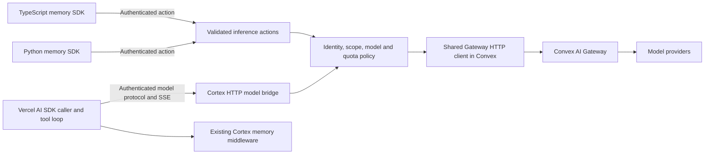

# Research Report: Convex AI Gateway for Cortex

**Generated:** 2026-10-02 (America/Los_Angeles)
**Latest scope authority:** [User decision gates](decision-gates.md) now exclude Python, legacy-Cortex migrations and external media storage. Transcript unlocks retain revisions/stale-memory detection; media is Convex-only within 20 MB, with future image-memory analysis deferred. Historical broader recommendations below are superseded. The latest instruction chooses clean-slate embeddings without prior model/dimension/schema constraints and confirms the remaining runtime defaults; earlier embedding migration or populated-profile restrictions are superseded.
**Source:** Official Convex documentation and announcements, published npm metadata, and read-only inspection of the current Cortex checkout.
**Status:** Final research; implementation and live Gateway access unverified.
**Planning update:** The user approves AI SDK 7 and deprioritizes legacy compatibility. The [backend runtime architecture](architecture.md) and [revised goal/task tree](../../_goals/convex-backend-runtime-2026-10-02/goal.md) supersede the initial transport-only/raw-HTTP/AI-6 recommendations below. Reactive runs, per-function policy and clean-slate embedding provenance are in the new planning scope; media generation complements retained artifacts. Decisions are excluded. Implementation and live qualification remain unverified.
**Research prompt:** [Self-contained request](../prompts/convex-ai-gateway-2026-10-02.md)
**Current implementation plan:** [Backend-runtime goal and ordered tasks](../../_goals/convex-backend-runtime-2026-10-02/goal.md)
**Historical plan:** Earlier transport-only recommendations are retained below as historical evidence; the current goal and decision register govern.

## Executive Summary

- Convex released **AI Gateway** on September 21, 2026. Centralizing Cortex's built-in inference behind it is feasible and would remove provider credentials from Gateway-mode client configuration. [Launch announcement](https://news.convex.dev/introducing-convex-ai-gateway/)
- The important boundary is execution: Gateway credentials are private to Convex actions. Cortex's Node, Python, and browser clients need authenticated Cortex backend entry points. [Gateway overview](https://docs.convex.dev/ai-gateway/overview)
- It is a managed inference gateway. Cortex still owns prompts, chosen model IDs, tools, memory orchestration, authorization, and stream lifecycle. Provider-routing request parameters are constrained. [HTTP API](https://docs.convex.dev/ai-gateway/api)
- The official AI SDK provider currently requires AI SDK 7 and newer Convex versions. Cortex's current provider and quickstart use AI SDK 6; a direct installation would introduce a major-version migration. [Setup](https://docs.convex.dev/ai-gateway/setup)
- **Primary recommendation:** Add an explicit `convex-gateway` inference mode backed by a shared default-runtime HTTP Gateway client, validated actions for internal memory work, and a narrow authenticated HTTP bridge for streaming model calls. Retain caller-defined tools, memory middleware, and existing direct/custom integrations. Prove compatibility before changing defaults.

## Research Questions & Findings

### 1. Availability and operational requirements

**Verified documentation:** Paid Convex teams can use Cloud production/dev deployments and linked local deployments. Free/disabled teams get `AiGatewayDisabled`; unsupported deployment modes get `AiGatewayUnavailable`. Anonymous local and self-hosted deployments need another inference path. [Overview](https://docs.convex.dev/ai-gateway/overview)

Use Convex 1.45+ for service tokens; linked local use needs 1.46+ and a current backend. Obtain credentials with `getServiceToken("ai-gateway")` inside each action request and let the runtime refresh them. Do not expose or persist those tokens. [Setup](https://docs.convex.dev/ai-gateway/setup)

**Observed package metadata:** `npm view @convex-dev/ai-sdk-provider@0.2.1 version peerDependencies dependencies engines repository --json` returned peers `ai: ^7.0.105`, `convex: ^1.45.0`, Node `>=22`, and adapters including `@ai-sdk/openai` 4.0.45. These metadata were inspected without installation. [Published package](https://www.npmjs.com/package/@convex-dev/ai-sdk-provider/v/0.2.1)

**Inference for Cortex:** Use Convex >=1.46 for the Gateway implementation and local test target. Keep the official provider optional for AI SDK 7 consumers; a default-runtime `fetch` implementation avoids requiring AI SDK 7 or Node 22 throughout the SDK. The transport still needs protocol compatibility tests.

### 2. Model interfaces and feature coverage

| Interface | Verified capability | Cortex implication |
|---|---|---|
| Chat Completions | JSON and SSE; forwards tools and structured-output parameters | Initial cross-provider chat surface; caller executes its own tools |
| Embeddings | Single input or batches up to 512 | Route existing embedding generation; preserve vector model and size |
| Anthropic Messages | Native JSON and SSE | Add a tested native lane where existing integrations require it |
| OpenAI Responses | Native JSON and SSE; stateless | Preserve reasoning/tool events; do not promise stored response continuation |
| Model list | Available model IDs | Validate allowed model IDs without shipping a permanent catalog |

The HTTP API limits request bodies to 16 MiB. Endpoint-specific routing controls are rejected; Chat Completions explicitly rejects `provider`, `route`, `models`, `transforms`, `plugins`, and `preset`. Responses does not support `store: true` or non-null `previous_response_id`. Convex replaces upstream IDs, so track an application request ID separately. [HTTP API](https://docs.convex.dev/ai-gateway/api)

Names use `provider/model`, such as `openai/gpt-4o-mini`. A catalog listing alone does not establish that a model supports every parameter or endpoint. [Models](https://docs.convex.dev/ai-gateway/models)

**Coverage caution:** The launch announcement described images/video as upcoming; current reference docs label images/video and Decisions alpha. Use current endpoint references for implementation, and exclude those alpha features from this migration. Marketing mentions audio but the overview does not enumerate an audio route; do not promise it. [Overview](https://docs.convex.dev/ai-gateway/overview), [Launch announcement](https://news.convex.dev/introducing-convex-ai-gateway/)

**Inference:** Gateway connectivity does not supply a documented Cortex-specific policy for choosing a cheaper/better model per operation. Keep model selection explicit. Do not infer configurable fallback chains or universal feature parity from the word router.

### 3. Client and streaming boundary

HTTP actions live on a deployment's HTTP origin, conventionally `.convex.site`, accept Fetch requests, and require manual body validation. They execute in the default Convex runtime. Discover or configure the HTTP origin explicitly, including local/custom deployments; do not blindly replace `.cloud` in URLs. [HTTP actions](https://docs.convex.dev/functions/http-actions)

HTTP response streaming is supported. Use an SSE bridge for the current Vercel middleware path, preserving backpressure and protocol events rather than writing every model token into a new database stream. Keep Cortex's existing persistence lifecycle as the owner of memory writes. [Convex 1.12 streaming announcement](https://news.convex.dev/announcing-convex-1-12/)

For authenticated HTTP actions, a bearer JWT is available through `ctx.auth.getUserIdentity()`. Its subject/issuer identify the principal; the host application supplies its Convex authentication configuration. [Authentication in functions](https://docs.convex.dev/auth/functions-auth)

**Proposed architecture:**

This is a proposed design, not a verified integration. A disposable spike must prove service-token use in HTTP actions, protocol forwarding, disconnect behavior, and each selected model/endpoint combination.

### 4. Current Cortex architecture and migration seams

**Observed in the current working tree:**

| Area | Evidence | Consequence |
|---|---|---|
| SDK configuration | `src/index.ts:59` declares `openai`, `anthropic`, `custom`; `src/index.ts:68` has a required provider API key in LLMConfig | Add a key-free Gateway configuration without requiring fake API keys |
| Automatic configuration | `src/index.ts:263` and `src/index.ts:493` resolve built-in LLM/embedding configuration | Explicit Gateway mode must avoid provider SDK loading and accidental env-based direct calls |
| Fact extraction and belief revision | `src/llm/index.ts:106` exposes extraction and optional `complete`; `src/llm/index.ts:651` returns only extraction for custom | A callback-only migration would drop LLM belief revision; implement both capabilities |
| SDK auth context | `src/index.ts:490` constructs ConvexClient without setAuth; `Documentation/security/authentication.mdx:15` describes auth as data | Add actual transport authentication; scope metadata is not proof of identity |
| Vector dimensions | `convex-dev/schema.ts:508`, `:624`, `:1283` specify 1536 | Preserve embedding family and dimensions; equal dimension alone does not ensure semantic compatibility |
| Vercel integration | `packages/vercel-ai-provider/package.json:81` advertises AI SDK 3–6 | Preserve old API surface; initially qualify the new model helper for AI SDK 6 only |
| CLI deployment packaging | `packages/cortex-cli/src/utils/schema-sync.ts` discovers/copies backend sources | Package/register helpers safely without overwriting the consumer's HTTP/auth router |

Additional verified migration details:

- `src/memory/index.ts:784` gates built-in extraction on an API key; a routed client requires explicit capability gating. `src/memory/index.ts:241` generates embeddings locally. Both paths need wiring, beyond adding a config enum.
- `packages/vercel-ai-provider/src/provider.ts:168` and `:257` delegate generation/streaming to the wrapped model. Factory paths in `src/index.ts:105` and `:293` currently construct Cortex with only a deployment URL; new inference/auth settings must reach all of them. The wrapper collects model text and invokes `rememberStream` during flush (`provider.ts:443` onward); it is not already persisting the source stream progressively.
- Python's `cortex/types.py:3186` has LLM config but no global embedding config. `cortex/memory/__init__.py:770` uses a per-call embed callback and recall accepts a precomputed vector at `:2050`. Global routed embeddings are an explicit parity addition. `_convex_async.py:119` provides bounded action transport, not a generic SSE client.
- The quickstart has separate chat/v6 and health routes with direct OpenAI requirements. The basic template directly constructs OpenAI. The chat-SDK template already uses **Vercel** `@ai-sdk/gateway` and `AI_GATEWAY_API_KEY` (`lib/ai/providers.ts:1`, `:24`); Convex Gateway must be distinctly configured.
- New backend functions are copied into customer projects (`utils/init/file-operations.ts:65` onward). An npm client update alone does not deploy or register them. Keep quickstart source and its CLI mirror synchronized through the existing sync script.
- Current sync/install helpers can copy a whole differing schema, replace a backend tree, or write a default functions directory. Gateway migration must use additive integration and preserve host schema tables/indexes, unrelated functions, custom functions paths, runtime settings, and HTTP/auth configuration.
- Chat-SDK title/artifact model helpers (`lib/ai/providers.ts:135` onward) select inference independently of chat. Include those paths in the transport inventory and integration checks so Gateway mode cannot leave hidden direct/Vercel-Gateway calls.
- Chat-SDK suggestions and text/code/sheet creation/update consume the artifact model via separate generation calls. The basic and chat-SDK templates have their own Vitest/runtime packages; chat-SDK uses pnpm and Next build. Basic `npm run build` includes `convex deploy`, so use offline TypeScript/unit checks and separately qualified development backend checks. CLI scaffold tests alone do not certify runtime migration.

The root lock resolves Convex **1.34.1**, AI SDK **6.0.3**, OpenAI **6.33.0**. The independent quickstart lock resolves Convex **1.31.6**, AI SDK **6.0.50**; its manifest requests newer compatible versions. Read manifests and locks together; refresh only affected locks during implementation.

The checkout is on `dev` and already contains CLI/config/admin-security modifications plus existing research/plans. This work created a separate dated topic. Rebase the plan against the actual code at execution time and preserve the ongoing changes.

### 5. Authentication, spend, and reliability

Gateway usage appears by project/function on the Convex bill at OpenRouter rates. Local linked inference also spends the linked team's budget. **A deployment AI Gateway disable threshold disables the whole deployment**, making a low inference cap a memory-availability risk. Team limits can lag in-flight requests or minted credentials. [Usage and billing](https://docs.convex.dev/ai-gateway/usage-and-billing)

**Design requirement:** New billable entry points deny access unless verified identity maps to a trusted inference grant. Do not trust `tenantId`, `userId`, memory-space IDs, or publicly writable membership records as authorization. Keep these grants and quota mutations internal/trusted. Reserve quota atomically before sending, limit tokens/input/concurrency, and reconcile known usage once. An unknown completion outcome retains conservative accounting until reconciled. Return policy errors without invoking a model.

Actions are not automatically retried; an external call can succeed despite a lost response. Same-runtime helpers avoid extra action hops. [Actions](https://docs.convex.dev/functions/actions)

**Design requirement:** Use request IDs for accounting/persistence deduplication, but do not claim provider execution is exactly-once. Do not automatically replay ambiguous calls or streams that have emitted output. Respect an explicit operation deadline and abort upstream where supported. Cancellation is best effort, with no promised refund. Propagate errors that must prevent memory completion and preserve existing deliberate partial-memory recovery.

**Documentation conflict:** Gateway setup and the limits reference give 30 minutes for default-runtime actions and 10 for Node, while the generic Actions page still says 10 minutes. HTTP Actions says request/response size is 20MB; the limits table says responses are 20 MiB without a specific request cap. Choose application limits below all relevant bounds (including the Gateway's 16 MiB body limit) and verify behavior in the spike. Do not use platform maxima as latency targets. [Setup](https://docs.convex.dev/ai-gateway/setup), [Limits](https://docs.convex.dev/production/state/limits), [HTTP actions](https://docs.convex.dev/functions/http-actions), [Actions](https://docs.convex.dev/functions/actions)

## Options Analysis

| Option | Benefit | Cost or limitation | Recommendation |
|---|---|---|---|
| Raw Gateway HTTP in Convex + Cortex client transport | Central credentials/billing; avoids an immediate AI SDK major upgrade | Cortex owns a narrow authenticated bridge and protocol tests | Choose for initial migration |
| Official `convexGateway` with AI SDK 7 | Maintained adapters and native model interfaces | AI 7/Node compatibility changes across provider, demo, and templates | Offer later or isolate behind a separate compatible entry point |
| Replace orchestration with Convex Agent component | Backend agent/tool/thread abstractions | Overlaps Cortex's memory/stream ownership and changes public semantics | Separate future proposal |
| Continue direct/custom integrations | Supports self-hosted/free/anonymous local and specialized models | Provider credentials remain necessary for those integrations | Retain explicit compatibility path |

No latency/cost improvement is claimed without measurement. Removing gateway markup does not remove action compute, function-call, egress, or persistence cost.

## Recommendations

1. Establish a small compatibility spike before defining final public types or updating dependencies broadly.
2. Add `inference.transport = "convex-gateway"` with explicit model settings, HTTP origin, and a host-supplied token callback. Preserve current direct behavior when omitted; no silent fallback from Gateway to direct providers.
3. Supply built-in extraction, conflict completion, and embeddings using authenticated actions. Keep existing extraction prompts/parsers and custom hooks unless a measured reason requires moving them. Bind per-operation scope explicitly rather than capturing one mutable tenant in a shared client.
4. Supply a Gateway-backed Vercel LanguageModel helper using a protocol-compatible adapter with authenticated fetch to Cortex HTTP actions. Wrap it with the existing Cortex memory integration. Arbitrary JavaScript tool implementations remain in the calling application; only tool schemas/results cross the bridge.
5. Qualify native Responses/Messages separately to retain required features; fail clearly for unsupported parameters/features. Keep history in Cortex rather than Gateway state.
6. Demonstrate zero provider keys for Gateway-mode SDK/quickstart use, then consider a future default change only for eligible deployments. Keep direct/custom mode documented for unsupported hosts.

## Decision Points

| Decision | Proposed default | What execution must resolve |
|---|---|---|
| Public mode | Explicit opt-in; old behavior when omitted | Exact callback/config precedence and env variables in Task 01 |
| Auth | Host's verified JWT + trusted inference grant | Consumer issuer/audience and demo service identity; no IdP chosen by this plan |
| API protocol | Chat + embeddings first; tested native lanes | Required reasoning/tool features and version matrix in Task 01 |
| Built-in extraction | Preserve prompts, parsed fact/entity contract, and conflict completion | Callback return types and parser sharing across SDKs |
| Models | Keep existing chosen models with qualified slugs | Availability and same-family embedding parity in disposable tests |
| Fallback | Direct/custom only by explicit configuration | No implicit billing/privacy/provider change on failure |

## Risks & Considerations

| Risk | Impact | Mitigation |
|---|---|---|
| Open billable proxy or forged tenant scope | High | JWT validation + internal grants + negative tests before exposure |
| Existing memory access treated as fully secured by inference auth | High | Document that legacy storage auth is a separate boundary; never reuse untrusted memberships as grants |
| Spend threshold interrupts memory availability | High | Application admission budgets and warnings; evaluate deployment kill switch deliberately |
| Embeddings change semantic space | High | Preserve exact model family/dimensions; no silent fallback model |
| Stream/tool/reasoning data lost | High | Protocol fixtures and native lanes with live confirmation |
| Ambiguous retry duplicates paid work/memory | High | No replay after partial/unknown success; idempotent local accounting and writes |
| Major-version ripple | Medium | Raw HTTP first, scoped Convex update, separate AI SDK 7 option |
| New source files not installed or host router overwritten | High | CLI packaging/scaffold tests and explicit host integration snippet |

## Implementation Considerations

**Prerequisites:** A user-authorized implementation run; independent goal review through feature-orchestrator; a verified disposable paid-team deployment or linked local target; host JWT configuration and a trusted test principal/grant; scoped dependency/codegen update. None was assumed or performed here.

**Dependencies:** Convex >=1.46 for Gateway mode/local parity. Native HTTP and token APIs in the default runtime. A version-matched caller-side AI adapter for the new Vercel helper. Existing direct providers remain optional.

**Estimated effort:** Medium-to-large cross-layer feature. Ten bounded tasks are sequenced in the goal. Estimates depend on auth integration and protocol results; the spike determines whether native protocol lanes ship together or as separately tested follow-ups.

## Knowledge Gaps

- [ ] Actual team eligibility, model availability, disposable environment, and auth prerequisites have not been checked.
- [ ] Service token + streaming HTTP action behavior, cancellation, buffering, latency, and reported usage need live evidence.
- [ ] Model-specific native reasoning, tool calls, JSON response behavior, and embedding equivalence need qualification.
- [ ] Existing consumer auth setups and exact AI SDK 3–6 obligations need a compatibility decision; the initial helper targets AI 6, without claiming new Gateway support on old majors.
- [ ] Data retention, processing-region guarantees, gateway SLA, and advanced routing/failover are not established by the reviewed pages. Existing governance controls must not imply unverified upstream guarantees.
- [ ] Platform timeout/body-limit documentation conflicts need a conservative contract and observed tests.

## Sources & References

All source links above were researched on 2026-10-02. Documentation and registry metadata are snapshots, not deployment certification. A read-only native subagent inspected SDK/Python/provider/CLI call sites. No external deep-research service was invoked, and no live inference or application quality gate ran.

Core sources: [Launch](https://news.convex.dev/introducing-convex-ai-gateway/), [Overview](https://docs.convex.dev/ai-gateway/overview), [Setup](https://docs.convex.dev/ai-gateway/setup), [Models](https://docs.convex.dev/ai-gateway/models), [HTTP API](https://docs.convex.dev/ai-gateway/api), [Usage/billing](https://docs.convex.dev/ai-gateway/usage-and-billing), [Provider package](https://www.npmjs.com/package/@convex-dev/ai-sdk-provider/v/0.2.1), [HTTP actions](https://docs.convex.dev/functions/http-actions), [Function authentication](https://docs.convex.dev/auth/functions-auth), [Actions](https://docs.convex.dev/functions/actions), [Limits](https://docs.convex.dev/production/state/limits).
